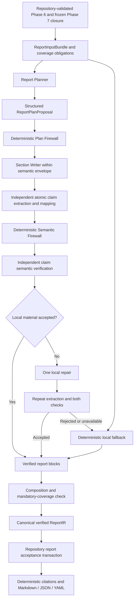

# Phase 8 — Full Report Compiler design

**Status:** Approved-candidate architecture, ready for user review. Design only; no Phase 8 implementation or implementation plan is authorized by this document.

**Date:** 5 October 2026.

**Accepted baseline inspected:** `d36f3b12b12ff8f0f13afd64ec09382d9e8ca066` (`d36f3b1`). Phase 7 is accepted and complete; the final independent remediation confirmation is [phase-7-remediation-review.md](../../reviews/phase-7-remediation-review.md). Its implementation target was `0cef9f7`, including `af28c25`; the subsequent accepted handoff changes documentation only. Recorded verification is 2,037 passed / 5 opt-in network tests excluded, with clean Ruff, formatting and Pyright in the implementation and independent detached checkouts. These are accepted baseline records, not new Phase 8 test results.

**Frozen Phase 6 baseline:** `e4dd4e09699f755dd0fe7b7bc3dd8be4e11f7ee1`. Its authority, support, chronology, classification and Gate 30 semantics remain unchanged. Historical FAIL reviews and implementation-era OPEN entries remain preserved. The approved Phase 7 design records the accepted Phase 6 baseline and passed Stage 1/Gate 30; this design does not reinterpret the historical entries as current blockers or revise them.

## 1. Objective and governing sources

Produce the final user-facing artifact without allowing prose generation to mutate adjudication. The primary output is a traceable nine-question narrative with evidence links, supported/qualified/unsupported wording, coverage, uncertainty, validation recommendations, Markdown, canonical JSON, YAML and an optional compact summary.

Phase 7 determines which conclusions are authorized. Phase 8 determines how those accepted findings are analysed, organized, synthesized and communicated. **Semantic authority** is the right to establish evidence, gates, verdicts and permissions. **Analytical freedom** is the freedom to explain those records, compare compatible findings, organize evidence, emphasize consequences and recommend validation. Phase 8 has substantial analytical freedom and no authority to change accepted novelty semantics.

Governing sources, in precedence order, are the user's Phase 8 design request, [master design specification](../../specs/master-design-spec.md), the approved [Phase 7 design](2026-10-02-phase-7-adversarial-review-neutral-adjudication-design.md) and [implementation plan](../plans/2026-10-03-phase-7-adversarial-review-neutral-adjudication-implementation-plan.md), and repository governance. Particularly relevant master anchors are INV-01–15; §§34–39.1, 44–47, 54–57; the Phase 8 roadmap/exit criteria; and Appendix C. The [Phase 6 completion](../../phase-6-completion.md), [historical review](../../reviews/phase-6-final-review.md), [Phase 7 completion](../../phase-7-completion.md) and independent remediation confirmation were inspected as acceptance history.

No missing field, model outage, restrictive token budget or elegant narrative may strengthen a conclusion. Phase 8's exit condition is that report content is fully traceable to frozen findings and has no unsupported new factual claims in golden tests.

## 2. Research-informed architecture decision

Select **Bounded Generative Reporting**: a hierarchical planner and section writer operate within a repository-derived semantic envelope, followed by independent atomic claim extraction, deterministic checks and independent semantic verification. Correction is local and bounded. Citations and output formats are rendered deterministically from the accepted ReportIR.

Research informs the components; the authority boundaries and repair limits are engineering decisions for this repository:

- Explicit content planning has improved attribution and citation accuracy in long-form question answering. This supports a reasoning model planning explanation before prose, while the experiment does not establish correctness for novelty assessment. [Learning to Plan and Generate Text with Citations, ACL 2024](https://aclanthology.org/2024.acl-long.615/).
- Question-answer blueprints address content selection and ordering as well as realization. This supports hierarchical question plans and explicit obligations for important content. [Conditional Generation with a Question-Answering Blueprint, TACL 2023](https://aclanthology.org/2023.tacl-1.55/).
- ALCE distinguishes answer correctness/coverage from citation support and citation relevance, and reports worse citation quality with post-hoc citing. Support alone is therefore an inadequate report acceptance criterion. Restrictive evidence-first generation can omit important findings even when the remaining sentences are supported; Phase 8 guards against that risk with mandatory coverage obligations alongside grounding. This last application to this compiler is a design inference, not a claimed universal experimental law. [Enabling Large Language Models to Generate Text with Citations, EMNLP 2023](https://aclanthology.org/2023.emnlp-main.398/).
- Long text can mix supported and unsupported atomic facts. Independent decomposition makes individual material assertions inspectable. Phase 8 adopts that decomposition principle without adopting an aggregate factuality score as an authority gate or introducing a novelty score. [FActScore, EMNLP 2023](https://aclanthology.org/2023.emnlp-main.741/).
- Attribution-guided editing offers a rationale for preserving acceptable text while correcting rejected material. Phase 8 uses a single local repair against existing authority and excludes the research/retrieval part of that approach. [RARR, ACL 2023](https://aclanthology.org/2023.acl-long.910/).

A downstream semantic model is fallible. It is not the only defense: the writer sees exact permissions and limitations before generating, identifiers and structured assertions are checked mechanically, extraction is independent, and deterministic fallback exists. This architecture does not claim formal proof of natural-language entailment or live-model quality qualification.

### Considered alternatives

| Option | Assessment |
| --- | --- |
| A. Pure deterministic templates | Useful for fallback; too restrictive for analytical explanation, grouping and narrative progression as the main product. |
| B. Deterministic claim bank plus LLM realization | Useful for authoritative facts/obligations; making it the entire content system constrains synthesis too heavily. The selected writer may express new compatible explanations, rather than only paraphrase a closed sentence bank. |
| **C. Bounded generative planner/writer plus semantic firewall** | **Selected.** Gives models meaningful planning and explanatory work while enclosing it in fixed authority, independent checking and bounded correction. |
| D. Full free-form report followed by verifier | Places too much burden on a downstream check; does not constrain authority escape before drafting or guarantee decisive-content coverage. |
| E. Multi-agent writer/critic/editor loop | Adds cost and whole-report regression opportunities after adjudication is already settled. No open-ended global rewrite loop is allowed. |
| F. One-shot report generation | Does not adequately separate planning, citation identity, factual assertions, permissions and verification. |

## 3. End-to-end compilation



Plan failure uses a deterministic coverage plan; it does not remove required findings. Writer, extractor or verifier failure uses the repair/fallback rules below. If composition remains unsafe, implicated question content is replaced by deterministic fallback. Valid authority always permits a complete safe fallback report. Authority validation failure stops compilation and publication entirely.

No semantic call receives a repository handle, search provider, research escalation port, browser, retrieval provider, shell, evidence mutation tool or citation-expansion tool. New research or corrected input belongs to upstream reassessment and produces a new authoritative Phase 6/7 state.

## 4. Actual baseline and compatibility boundaries

| Existing component at `d36f3b1` | Design consequence |
| --- | --- |
| `adjudication/frozen.py` real `FrozenAdjudication` | Reuse its assessment/context/snapshot/run/case IDs, target findings, overall finding, exact dependencies, qualifications, counterfactuals, limitations, unresolved questions and language classes. Do not use the Phase 1 fixture class. |
| `Phase7AdjudicationRepository.load_frozen_adjudication` and `phase7_store.py` | Frozen authority is revalidated against complete dependencies and current Phase 6 authority in one explicit SQLite read transaction. Extend this validation through an in-session report loader; sequential public calls alone do not prove one consistent read. |
| `Phase6AssessmentView` | Sole verified prior-art authority: exact classified chains, projection status, authorized relations, cited passages, targets, candidate outcomes, coverage, lineage, multi-source/patent context and audit references. Construction alone is not authority. |
| Repository-sealed `Phase7InputManifest` / `SealedAssessmentContext` | Authoritative binding for CIR, sufficiency, graph/version, reviewed research state, cumulative budget, query/provider/access/stop history and remaining gaps. Preserve historical UNKNOWN state. |
| Accepted Phase 7 execution envelope and method/config registration | Follow its trusted runtime provenance pattern. Do not trust model-supplied version labels or silently relabel old outputs. Report executions use their own registry, outside the Phase 7 artifact vocabulary. |
| `domain/reporting.py` | Reuse the exact `CANONICAL_QUESTIONS`. Existing `ReportAnswers` / `CompiledReport` remain fixture contracts. `Phase7FrozenSummary` is a labeled derived summary, not the full report. |
| `reporting/minimal.py` | Preserve legacy fixture compilers and `summarize_frozen_phase7`, which reloads real frozen authority. Do not coerce them into a real ReportIR. |
| `application/vertical_slice.py` | Real Phase 7 currently emits a frozen export and labeled summary, then completes its lifecycle. Full report compilation gets a separate report attempt; it does not reopen the frozen adjudication or replay the research lifecycle. |
| `runtime/artifacts/writer.py` | Its atomic replace operation overwrites named exports. Use it for derived exports after report acceptance, not as an immutable report acceptance store. |
| Schema v8 Phase 7 artifact store | Artifacts are scoped to Phase 7 runs and checked as exact frozen dependencies. A terminal run cannot become a report artifact container. |

The accepted M1 limitation is real: `FrozenAdjudication.value_findings` and `novelty_significance` are empty on the real path. Sealed CIR claimed advantages and exact Gate D dependencies remain available. This design consumes those records without filling the empty arrays or changing Phase 7.

## 5. Invariants

| ID | Required invariant |
| --- | --- |
| RPT-01 | Only repository-authoritative accepted assessment/adjudication state seeds compilation. |
| RPT-02 | Compilation never changes a Gate, verdict, qualification or assessability result. |
| RPT-03 | Synthesis can combine compatible descriptions but cannot create evidence or graph authority. |
| RPT-04 | Every material factual/adjudicative assertion has an exact authoritative basis. |
| RPT-05 | Wording stays within each target's Phase 7 language permission and claim scope. |
| RPT-06 | No direct precedent in reviewed scope never means universal absence. |
| RPT-07 | A negative finding remains scoped to its accepted claim/target. |
| RPT-08 | UNASSESSABLE never becomes positive or negative novelty. |
| RPT-09 | Value and differentiation cannot modify novelty permission. |
| RPT-10 | Missing authoritative value findings cannot be filled by model inference. |
| RPT-11 | Mandatory findings and verdict-material limitations cannot be omitted. |
| RPT-12 | Planner, writer, extractor, verifier and repair outputs are untrusted proposals. |
| RPT-13 | Verification may reject language; it cannot establish stronger underlying semantics. |
| RPT-14 | Citations resolve only from repository evidence; models cannot create URLs or bibliography. |
| RPT-15 | Compact summary cannot strengthen or contradict accepted full-report content. |
| RPT-16 | A lens affects presentation and recommendations, not adjudication. |
| RPT-17 | Phase 8 has no search, research, retrieval or citation-expansion capability. |
| RPT-18 | Operational generation failure never changes an epistemic conclusion. |
| RPT-19 | With valid authority, deterministic fallback can produce a complete permission-safe report. |
| RPT-20 | Markdown, JSON and YAML represent one accepted ReportIR. |
| RPT-21 | Every report artifact binds assessment, adjudication, sealed context, snapshot and compilation attempt; foreign artifacts fail closed. |
| RPT-22 | Actual runtime executions, approved methods/configurations and exact text hashes are joined before acceptance; proposal provenance and traces confer no authority. |
| RPT-23 | Acceptance/load revalidate the exact upstream and report dependency closure transactionally. Missing authority is a hard failure. |
| RPT-24 | Extraction completeness is checked independently against actual public text; writer annotations or an empty extraction cannot self-certify a draft. |
| RPT-25 | One local repair maximum per rejected cluster; no recursive repair, whole-report rewrite or voting rule can authorize text. |
| RPT-26 | Recommendations are prospective, typed and basis-linked; they do not imply experiments/results exist. |
| RPT-27 | Append-only report attempts preserve earlier outputs and provenance; observation time never determines semantic identity. |

## 6. Contract vocabulary

New report contracts use the existing frozen Pydantic `ContractModel` conventions, `extra="forbid"`, explicit versioned `contract_kind`, canonical serialization and timezone-aware UTC observations. Reuse `VerdictState`, `ValueMaturity`, `LanguagePermissionClass`, target identities and upstream typed contracts. Do not define a second novelty verdict enum.

Every report artifact carries `ReportScope(assessment_id, adjudication_id, assessment_context_id, phase6_snapshot_id)` and, after beginning compilation, `compilation_id`. Target assertions also carry target ID/kind and exact claim scope. These fields are not optional identity hints.

| Contract | Payload / responsibility |
| --- | --- |
| `ReportInputBundle` | Validated upstream projection, typed authority references and deterministic obligations (§7). |
| `AuthorityRef` | Discriminated kind, native ID, canonical digest, scope, optional target, and field/record path where the upstream record has no separate ID. Prevents ambiguous generic ID joins. |
| `ReportOptions` | Lens, detail level, compact-summary flag, render policy and bounded generation limits. No novelty override or research option. |
| `ReportPlanProposal` / `ReportPlan` | Untrusted hierarchy / validated presentation plan, respectively. Validation status is application-attached, not a model field. |
| `SectionContext` / `SectionDraft` | Bounded question authority/display closure / structured prose blocks with basis candidate IDs. |
| `ReportClaim` / `ClaimBasisLink` | Independently extracted assertion with exact text spans, use/category/scope and proposed typed basis. |
| `ClaimVerification` | Text/basis/permission digests, support disposition, unmet qualification, reasons and execution reference. No new verdict or Gate state. |
| `ValidationRequirement` | Prospective demonstration proposal, target/basis IDs, method, baseline/measure/success criterion if applicable, and explicit recommendation status. |
| `ReportCitation` / `CitationRegistry` | Claim-to-authoritative-source/version/passage resolution and deterministic display identities. |
| `ReportIR` | Canonical accepted content graph, sections, claims, findings projection, citations, coverage, uncertainty and provenance. |
| `CompiledAssessmentReport` | Immutable accepted wrapper: report ID, compilation identity, ReportIR, exact dependency manifest, method/config versions and acceptance observation. |
| `ReportExecutionRecord` | Trusted adapter/runtime invocation envelope, distinct from proposal fields and trace delivery. |
| `ReportCompilationRecord` | Immutable attempt header; append-only status events recorded separately. |
| `ReportArtifact` | Scoped immutable wrapper with artifact ID, typed kind/document, method version and execution reference where applicable. No arbitrary untyped JSON authority. |

`ReportIR` is the canonical semantic report, not an intermediate prompt. `CompiledAssessmentReport` is the persisted presentation product, not an adjudication. An accepted wrapper, JSON export or caller-created model still requires repository validation before authoritative loading.

## 7. Repository-authoritative input bundle

Public authority entry point:

```text
load_report_input_bundle(
    assessment_id: AssessmentId, *, adjudication_id: str
) -> ReportInputBundle
```

This is a new report repository read operation on the existing engine. In one explicit SQLite read transaction it:

1. Resolves the real frozen manifest and uses the same Phase 7 frozen-closure validator, including terminal FROZEN/ABSTAINED state, exact dependencies, current methods/provenance, resolved semantics and deterministic permission validation.
2. Loads its exact sealed context/input manifest and exact Phase 6 snapshot through existing in-session authority checks. Checks assessment, context, snapshot, cutoff, CIR/graph digests and full target universe.
3. Resolves every referenced Gate, qualification, counterfactual, role/rebuttal, judge comparison/resolution, research/input need and supersession record needed for reporting. Ancestor history is labeled history; it is never current target evidence.
4. Builds an eligible evidence index from the exact validated Phase 6 view. All frozen decisive/supporting/challenged references are retained, together with their complete comparison, scoped remainder, contradiction, chronology, context and lineage closure. Other comparisons in that same accepted snapshot may be explanatory candidates, explicitly marked as such; they cannot change accepted target conclusions. No wider database search or uncited parent-document mining is allowed.
5. Uses the real normalization `SourceRecord` and optional `SourceVersionRecord` retained as `comparison.comparison.chain.source` and `.version` in each validated committed comparison. Rejoins their source/version content authority and exact cited `PassageRecord`/attestation ancestry. Graph node attributes are not assumed to contain a fictitious richer source object. Bibliographic fields missing from the committed records remain unknown; differing metadata observations are retained with their comparison references rather than silently replaced by a newer-looking record. Metadata cannot confer equivalence authority.
6. Computes a bundle digest and exact typed dependency manifest, report-facing projections, language envelopes and coverage obligations before returning.

Bundle fields are `scope`, `as_of`, `bundle_version`, `bundle_digest`, real `frozen_adjudication`, sealed `input_manifest_ref`, `cir`, `graph_or_version`, `target_profiles`, `target_findings`, `overall_finding`, `gate_findings`, `qualifications`, `eligible_comparisons`, `authorized_relations`, `cited_passages`, `source_metadata`, `research_state`, `input_needs`, `research_gaps`, `judge_resolutions_and_limitations`, `counterfactuals`, `value_projection`, `language_envelopes`, `coverage_obligations`, `dependency_manifest`, and `audit_refs`.

The bundle is a temporary validated projection; it does not copy the evidence graph into a new store. Prior-art facts still derive from Phase 6, accepted interpretation from frozen Phase 7, proposed input/claimed advantage from the sealed CIR, and research limitations from sealed research/ledger records. Trace references explain execution but cannot supply facts. No API takes arbitrary evidence lists or exported frozen JSON as a substitute for locators.

Eligibility preserves GRAPH_AUTHORIZED, SEMANTIC_ONLY and NONRELATIONAL_STATUS exactly. A semantic-only classification may be explained as a committed status but cannot become an authorized graph relation or override the frozen target finding. Post-cutoff, uncertain-chronology, unsupported and excluded candidates can explain limitations; they cannot be narrated as eligible established earlier precedent contrary to their accepted state.

### Coverage obligations

`CoverageObligation` has obligation ID, question IDs, target scope, authority refs, requirement kind and materiality origin. Required kinds include target-universe representation, decisive precedent, scoped negative, surviving candidate/residual, accepted challenge, language ceiling, actual limitation, missing value authority and coverage/stop/access state.

These obligations are derived mechanically from upstream records. The planner cannot mark one immaterial. All limiting factors attached to frozen target/overall findings and Gate/judge resolutions are mandatory at their relevant assertions and in Q9; additional bound failures/coverage gaps remain visible in the coverage/uncertainty summaries. A display limit never removes an obligation. If a dependency cannot fit a semantic call, use separate bounded contexts or fallback for the affected content, not silent truncation.

## 8. Hierarchical Report Planner and Plan Firewall

`ReportPlannerPort.plan(context: PlannerContext, options: ReportOptions) -> ReportPlanProposal` is a stateless provider-neutral call. `PlannerContext` contains the bundle's report-oriented authority projection, complete obligation catalog and eligible citation identities. It contains no access methods.

`ReportPlanProposal` contains exactly nine ordered `QuestionPlan` records. Each has `question_id`, `analytical_thesis`, ordered `subsections`, `target_ids`, `evidence_refs`, `adjudication_refs`, `required_limitation_refs`, `obligation_ids`, `proposed_synthesis`, and `desired_depth`. A subsection has an ID, proposed heading, analytical purpose, evidence/comparison group, typed intended claim categories/permissions, obligation links and depth. The planner may select groupings and ordering, propose explanations and foreground important precedents. Depth is SHORT/STANDARD/DETAILED; it does not alter coverage requirements.

The outer order is Q1–Q9 in Phase 8. Inner structure is generative: for example Q2 may discuss closest overall architecture, closest mechanism and closest meaningful combination in an order suited to the actual case. It is not a predefined subsection template. Lens and detail configuration guide presentation without choosing the underlying reality.

`validate_report_plan(proposal, bundle, options) -> ReportPlan` mechanically checks:

- Exact scope, bundle digest and question universe/order; unique subsection IDs and bounded hierarchy/size.
- Every native reference and target belongs to the eligible bundle; each selected evidence unit brings its complete relevant limitations and citation closure.
- Every obligation has an explicit home; decisive findings and mandatory limitations cannot be omitted or assigned only to an invisible subsection.
- Typed intended assertions obey question rules: Q1 input description; Q3 exact negative scope; Q4 scoped candidate permission; Q6 value projection; Q8 exact language envelopes; Q9 actual unresolved-state refs.
- No proposed verdict/Gate override, unknown source, research action, unsupported value maturity or expanded claim scope.

The firewall validates structure and typed intent. It **cannot prove the truth of an arbitrary natural-language thesis or heading**. Theses remain untrusted drafting instructions. Any thesis/heading that becomes public text is independently extracted and verified with its section. Enumerated intent flags cannot certify conflicting prose. Obvious forbidden constructs are rejected early, but semantic paraphrases are checked by the independent verifier.

Invalid plans are recorded and replaced by a deterministic coverage plan. There is no planner debate or repeated global plan optimization. Schema recovery is bounded as specified in §23.

## 9. Section Writer and analytical synthesis

`SectionWriterPort.write(context: SectionContext) -> SectionDraft` realizes one approved question plan. It receives that plan, the relevant authority closure, exact language envelopes, required limitations, obligations, eligible citation IDs, lens/style and remaining operational allowance. Global target/overall verdict and scope constraints accompany every section to prevent local overgeneralization.

The default is nine independent section calls after planning. A context includes complete meaning of every selected comparison, including missing relationships, scoped unsupported remainder, contradictions, chronology/access limitations and combination topology. Short displays retain an explicit omission manifest; omitted material cannot become decisive basis. Required material that cannot be displayed is rendered by fallback or supplied in another bounded call.

`SectionDraft` contains ordered `DraftBlock`s: headings, paragraphs, list items and table cells, with plain text and typed citation tokens/basis candidates. It is not raw HTML/Markdown with free URLs. Inline styling is a small allowed vocabulary; final Markdown is rendered by code. Candidate mappings supplied by the writer are hints for independent extraction, not certificates. Writer output has no final-verdict, Gate mutation, qualification grant or provenance-authority fields.

Compatible synthesis is allowed. If A establishes X, B establishes Y, and frozen findings locate a substantive candidate in R, the writer may explain that individual components are established and that the surviving candidate concerns R. It cannot claim A+B is one direct combination precedent, that R has never existed, or that its advantage is demonstrated. Several basis links support the several clauses, with each source kept distinct.

New explanatory ordering, analogies of presentation and recommendations are permitted. New empirical facts, technical capabilities, dates, source identities or reassessed novelty outcomes are not. Source facts must be within the admitted exact passage/comparison content; model memory cannot enlarge that evidence.

## 10. Independent atomic extraction and mapping

`ReportClaimExtractorPort.extract(context: ClaimExtractionContext) -> ClaimExtractionProposal` runs in a fresh stateless invocation, separate from the writer. It receives actual draft text/structure, candidate basis catalog and permitted categories. It never receives the writer's private reasoning or a privileged statement that all its claims are correct.

Each `ReportClaim` has claim ID, block ID/text digest, exact half-open text spans, normalized assertion, category, `ClaimUse`, target IDs/kinds/scope, basis candidates, citation candidates and required qualifications. Categories are INPUT_DESCRIPTION, SOURCE_FACT, EQUIVALENCE_DESCRIPTION, NOVELTY_INTERPRETATION, NEGATIVE_CLAIM, POTENTIAL_NOVELTY_CLAIM, VALUE_CLAIM, COVERAGE_CLAIM, UNCERTAINTY_CLAIM and VALIDATION_RECOMMENDATION.

`ClaimUse` distinguishes ASSERTION, ATTRIBUTED_INPUT_CLAIM, RECOMMENDATION and DISALLOWED_WORDING_EXAMPLE. A Q8 quotation of “no prior art exists” labeled as unsupported is not treated as an authorized assertion; nor can an asserted universal absence be hidden by tagging it an example. Actual discourse meaning is verified.

Split composite sentences into independently checkable material assertions. Include presuppositions, causal implications, comparative statements, headings, captions, table cells, summaries and statements of absence. Nonmaterial connective prose can have no external citation but remains checked in context for hidden assertions. Every material factual/adjudicative claim needs basis; not every basis is an external source.

Deterministic checks prove span bounds, text hashes and block accounting, not semantic completeness. The verifier independently examines the original block and surrounding context for assertions omitted/misrepresented by extraction. Every public block receives a completeness disposition. Empty extraction, omitted table cells or unaccounted headings never establish acceptance. A missing material assertion rejects the local cluster; repair/re-extraction or fallback follows. No self-certified extractor success substitutes for independent completeness checking.

## 11. Deterministic Semantic Firewall

`check_report_claims(draft, extraction, bundle, plan) -> FirewallResult` validates serialized content again. Checks include:

- Exact report/target scope, text spans/digests, extraction coverage records, typed reference membership and basis closure.
- Exact accepted verdict labels, Gate states and claim-language classes when represented structurally; no unsupported strong-positive or whole-configuration claim.
- Allowed claim category/use for each question, authoritative value maturity when asserted, explicit recommendation status and linked validation basis.
- Citation source/version/passage ancestry and commitment/target applicability; a citation cannot be reassigned merely because its title looks relevant.
- Structured required-qualification/obligation coverage and retained unresolved/coverage facts; accepted text cannot certify coverage by listing IDs in an unseen field.
- Known forbidden wording/URL constructs as early rejection, and prohibited synthesis flags such as source stitching or universal absence.

Cheap lexical checks do not establish that all paraphrases are safe. For example, code can reject an explicit unsupported `UNIVERSAL_ABSENCE` intent; it cannot reliably prove that “there is nothing like this anywhere” has been adequately qualified. That meaning is checked by the semantic verifier. Likewise, deterministic membership cannot prove a real passage entails an arbitrary sentence. Both layers must pass.

No average citation score, confidence threshold, majority of supported sentences or source count can excuse a rejected material assertion. A rejected decisive limitation is not repaired by deleting its obligation.

## 12. Independent claim-level semantic verification

`ReportClaimVerifierPort.verify(context: ClaimVerificationContext) -> ClaimVerificationBatch` uses an independent stateless invocation. Independence means separate task/instruction and context state from drafting/repair; the same configured model may implement both roles, but no writer conclusion or hidden reasoning is passed as a verdict. A second vendor is not required or treated as a vote.

Context includes actual public text, extracted claims, surrounding question/discourse, exact authoritative basis, full target language envelope, relevant contradictions/residuals, obligations and scope. The verifier asks only whether the assertion faithfully expresses those records. It cannot re-evaluate directness, decide whether a difference should be substantive, change a Gate, grant new permissions or introduce evidence. Its output schema contains no such authority fields.

Use three dispositions:

- **SUPPORTED:** The exact rendered assertion is faithful, including necessary qualifications and attribution, and its basis supports it.
- **REJECTED:** Overstated, unsupported, contradicted, omitted mandatory qualification, incorrect scope, wrong recommendation/quotation use, or incompatible synthesis. Typed reason codes identify the defect and local cluster.
- **UNRESOLVED:** Ambiguous assertion or insufficient verification result/completeness. It is not acceptance; repair/fallback applies.

A qualified statement can be SUPPORTED when the qualification is already in the text. A suggestion to add a qualifier is not acceptance of the old text. Reasons refer to basis IDs, permission/obligation IDs and public spans, not new adjudicative judgments. Proposed corrections are untrusted and cannot become authoritative text without the full checks.

The batch also reports extraction completeness and whether mandatory limitations are actually expressed. Missing or duplicate claim dispositions fail the batch. Disagreement between mechanical checks and semantic support is rejection; neither model popularity nor repeated sampling can override it.

## 13. Local repair, fallback and composition

A `RepairCluster` is the smallest contiguous block group needed to correct a violation with its context—normally one paragraph, list item or table row. It owns the related claims/obligations and has a stable origin ID. Joining overlapping failures creates one cluster before repair. Changed segmentation cannot reset its repair allowance.

The section writer port exposes a separate `repair(LocalRepairContext) -> SectionDraftFragment` mode using registered `p8-repair-v1`. The context contains only the original local material, exact reason codes, relevant authorized basis, required qualifications/limitations and a read-only neighboring-text window. It cannot edit neighboring blocks, drop mandatory coverage or change the plan. **One repair attempt per rejected cluster maximum.** A repair invocation gets no recursive schema-recovery call; malformed repair goes to fallback. Provider transport policy cannot turn this into another semantic repair attempt.

After repair, extraction, mechanical checks and independent verification run afresh on the actual replacement text. Still-rejected, unresolved or unavailable checks cause deterministic replacement. If the defect affects subsection structure or a section-wide limitation, replace that subsection/question rather than pretend a one-sentence patch is enough. No whole-report generative rewrite is permitted.

Generation origin is GENERATIVE_ACCEPTED, GENERATIVE_REPAIRED or DETERMINISTIC_FALLBACK per accepted block, with rejected originals and reason records retained in the audit store. Mixed provenance is normal and disclosed in machine output and a concise generation note.

### Safe fallback

Fallback is a versioned deterministic renderer over the bundle and obligations. It may use templates because it is the failure path, not the main analytical architecture. It renders exact target scope/verdict, relevant established/candidate facts, complete residual/limitations, actual coverage/uncertainty, Q6 missing value authority, Q8 safe scoped wording and Q7 prospective requirements. It works when every semantic provider is unavailable.

Free upstream prose is quoted and attributed as input, source passage, accepted rationale or limitation rather than silently converted into a new asserted fact. Unsafe markup/URLs/instructions in that prose are escaped. Fallback citations still resolve through exact authority links. Canonical safety wording and enum-to-description mappings are versioned and tested. Fallback does not demand a successful semantic model check of its known deterministic transformations; it requires deterministic validation of the transformed fields/bases/obligations.

Acceptance and load recompute fallback blocks from the authoritative bundle and pinned renderer version and require exact equality. A caller-applied DETERMINISTIC_FALLBACK label cannot bypass claim verification for arbitrary text. The deterministic compact summary is checked by the same recompute-and-compare rule against accepted ReportIR.

### Composition

After local acceptance, deterministic checks ensure Q1–Q9, all expected targets, obligation satisfaction, exact findings, citation links and coherent reference resolution. The verifier makes one bounded composition-check invocation over the assembled public narrative, accepted claims and complete permission/limitation envelope to detect cross-section implications, pronoun scope drift and contradictions. It may reject implicated blocks; it cannot rewrite the report.

Composition rejection replaces implicated context units with deterministic fallback; attribution that cannot be localized triggers fallback for the affected question(s), or the whole report if scope is indeterminate. There is no new generative repair budget at composition. Final fallback replacements are checked mechanically; no repeated global semantic loop is opened. Summary generation is deterministic as described in §18. Authority is revalidated again before acceptance.

## 14. Nine-question behavior

The exact text in `domain.reporting.CANONICAL_QUESTIONS` is reused, in its existing Q1–Q9 order. The following defines obligations and permissions, not fixed inner prose or subsection layouts.

| Question | Required authority and behavior |
| --- | --- |
| **Q1 — What exactly is being proposed?** | Explain sealed CIR, reconciled graph/version and expected targets. Preserve unspecified meaning as unknown. No novelty conclusion or inferred user mechanism. |
| **Q2 — What already exists that is closest?** | Explain relevant exact Phase 6 comparisons: what the source does, target challenged, why close, differences, source/version dates and evidence limitations. All decisive evidence is mandatory. Give precedence to frozen decisive equivalence/claim relevance; the planner can group/order eligible sources within that constraint, not promote an analogy by similarity or invent a new ranking authority. |
| **Q3 — Which parts are already established?** | Express exact accepted target-negative findings and verified component precedent within scope. Strong-partial claim-level negative remains labeled strong partial with its complete localized NON_SUBSTANTIVE residual rule. Individual components do not establish the meaningful combination. |
| **Q4 — Where does novelty appear to live?** | Explain only accepted substantive surviving candidates and their MCU, relationship, control-flow or combination scope. Include counterfactual/residual limitations. No global absence, certain novelty, stronger verdict, or positive inference from unresolved meaning. |
| **Q5 — What is the strongest evidence against the novelty claim?** | Present strongest accepted/verified challenge fairly, retaining concessions, limitations and exact evidence. Resolve accepted IDs through committed neutral projection/role mapping and resolved judge semantics. Rejected/uncertain arguments may be described with that status, never as accepted. If no accepted challenge exists, say so; explain the frozen evidential limitation rather than invent one. |
| **Q6 — Does the remaining difference create a meaningful advantage?** | Use authoritative value findings if present and distinguish attributed claimed advantages from assessed value. Preserve M1 as explicit missing value assessment. Gate D contribution significance does not prove utility or measured advantage. |
| **Q7 — What would need to be demonstrated?** | Generate prospective, basis-linked validation requirements. They can be useful and specific without claiming demonstrations already exist. Unknown user meaning is a clarification requirement, not a search performed by this phase. |
| **Q8 — What can defensibly be claimed today?** | Provide supported wording, safer qualified wording and clearly labeled unsupported/overbroad examples under exact target permissions. Preserve mixed/unassessable results and production strong-positive ceiling. |
| **Q9 — What remains uncertain or insufficiently researched?** | Group actual bound uncertainty: coverage, cumulative budget/stop, provider/access, input needs, unresolved evidence, chronology, decomposition, judge limitations and missing value assessment. No generic disclaimer substituted for actual limitations. |

Q2/Q5 selection does not conduct adjudication. If the frozen record does not select one exclusive strongest source/challenge, the planner may explain several accepted relevant challenges and identify its presentation emphasis, without declaring a new winning semantic interpretation. All decisive sources and materially relevant limitations remain visible.

## 15. Q6 and accepted M1

`ValueProjection` separates AUTHORITATIVE_VALUE_FINDING, ATTRIBUTED_INPUT_CLAIM and NO_VALUE_ASSESSMENT. It resolves existing real `value_findings` with exact target scope and maturity; no caller-created value object is accepted. CIR `claimed_advantages` can be quoted as the submitter's claims, including their recorded labels, but are not promoted to an assessed PLAUSIBLE/SUPPORTED/DEMONSTRATED advantage merely because the CIR contains such wording.

The actual Phase 7 frozen validator checks any supplied value entry against the sealed CIR's claim statement and maturity. That join establishes faithful input attribution; it is not an experiment or an independent value assessment. Array presence alone therefore cannot authorize assessed value language. AUTHORITATIVE_VALUE_FINDING requires a resolvable accepted upstream value-validation basis as well as the scoped finding; Phase 8 creates no such basis or issuer. Where only the sealed-input join exists, use ATTRIBUTED_INPUT_CLAIM and retain NO_VALUE_ASSESSMENT for assessed value. The current real path has no such assessed-value authority.

At the accepted baseline, real `value_findings` is empty. Q6 must state that no authoritative value assessment is available. It may explain the recorded claimed advantage, how it relates to a retained difference, and what would test it. It cannot conclude that the difference is advantageous by model intuition. If no target binding exists for a claimed advantage, preserve it at input/assessment scope; do not invent a per-MCU value finding.

Real `novelty_significance` is also empty. Contribution-significance explanation uses existing authoritative Gate D state, resolved counterfactual and target dependencies. This is a report projection of actual findings, not new entries in Phase 7's empty array or a freshly computed materiality judgment. If those dependencies are unresolved, explanation remains unresolved.

CLAIMED, PLAUSIBLE, SUPPORTED and DEMONSTRATED may be asserted as assessed value maturity only with corresponding authoritative value findings. Unknown is a report availability state, not a fifth `ValueMaturity`. High value plus direct precedent remains negative; weak/unproven value plus an accepted substantive candidate remains potential. M1 does not block a correct report and is not silently repaired in Phase 8.

## 16. Q7 prospective validation semantics

`ValidationRequirement` has requirement ID, scope/target IDs, basis refs, `status=RECOMMENDATION`, purpose, proposed method, baseline/comparator refs or generic baseline description, proposed measurements, optional proposed success criterion, missing input/evidence refs and limitations. It has no observed result, performed experiment or upgraded value maturity.

The model can recommend controlled experiments, ablations, resource/cost analysis, latency/throughput/reliability testing, user studies, deployment evidence and market comparison. Recommendations can combine related claimed advantages and unresolved gaps into a useful test design. For example, propose an ablation of accepted relationship R against the nearest admitted comparison, measuring latency and failure rate, while explicitly stating that no result is established.

A numeric target is allowed as a proposed evaluation criterion, labeled as a choice to justify, not an observed improvement or externally established benchmark. External named baselines/products must be eligible existing records; generic experimental concepts need no invented bibliography. The verifier checks relevance, recommendation framing and embedded factual premises. A recommendation cannot assert unsupported capabilities of a suggested comparator, fabricate an experiment, settle input meaning or claim research has been performed.

Fallback Q7 derives minimum demonstration/clarification needs from bound claims, needs, gaps and value absence. Generative Q7 may provide richer test design within the same permission. Neither path calls research.

## 17. Q8 wording and Q9 uncertainty

`ClaimWording` records target/claim scope, wording text, class, use SUPPORTED/QUALIFIED/UNSUPPORTED_EXAMPLE, basis/permission refs and necessary limitations. Supported and qualified versions receive full claim verification. Unsupported examples are explicitly marked as examples to avoid and retain violation reason codes. They are never listed as permitted claims.

Reuse target-specific `LanguagePermissionClass` values: CLAIM_SPECIFIC_NEGATIVE, SCOPED_POTENTIAL, QUALIFIED_STRONG_POSITIVE, MIXED_BY_TARGET, ABSTENTION, COVERAGE_LIMITATION and SEPARATE_VALUE_FINDING. An overall permitted-class union does not grant every class to every target. Whole-configuration wording requires the actual frozen whole-configuration finding. Phase 8 cannot invent robustness/domain qualification, grant STRONG_EVIDENCE_OF_NOVELTY or recompute permissions from more attractive prose.

Forbidden transformations include reviewed-scope no-direct → universal absence, potential → definite novelty, one negative MCU → whole-project unoriginality, UNASSESSABLE → either novelty conclusion, and a strong partial → direct. The verifier checks synonymous phrasing, comparative implications and disclaimer placement, not just enum labels or a blacklist.

`UncertaintyItem` retains a stable authority-ref-derived ID, target/assessment scope, upstream kind, actual state/reason, relevant question/claim links and source refs. Report grouping can merge presentation of related items but keeps all original IDs and meaning. A limitation attached to an included conclusion must accompany that conclusion and appear in the uncertainty summary/Q9; burying it only in an appendix is insufficient. BUDGET_STOPPED, NO_NEW_YIELD and PROVIDER_BLOCKED retain their distinct meanings. Cumulative usage/history is described as stored, not recomputed into saturation or research sufficiency.

Coverage summary includes evidence-family/target/strategy cells and their recorded assessment/attempt/stop/access states, eligible/excluded/unassessed/failed candidates and remaining gaps where available. It does not collapse source count into independent evidence or generate a novelty probability. Historical unknown coverage remains explicitly unknown.

## 18. Canonical ReportIR, formats and compact summary

`ReportIR` contains:

```text
scope; as_of; bundle_digest; report_contract_version
exact overall_finding and target_findings projection
sections[Q1..Q9] with approved hierarchy and accepted blocks
material_claims; claim_basis_links; verification_refs
coverage_obligations and satisfaction links
citation_registry
coverage_summary; uncertainty_summary
supported_and_qualified_wording; unsupported_wording_examples
validation_requirements; value_availability
compact_summary (optional)
generation_provenance; report_limitations
source_dependency_manifest; report_artifact_dependencies
```

The compiled wrapper adds report/compilation IDs, registered planner/writer/extractor/verifier/repair/firewall/fallback/citation/render versions, actual execution refs and acceptance observation. All references resolve to typed records. Evidence text/graph is not duplicated as a second authority; accepted prose and necessary citation locators are stored, with upstream facts referenced and projections checked for exact equality.

Canonical JSON is the primary structured serialization using existing canonical hashing conventions. YAML is a safe serialization of that identical JSON-compatible structure: no custom tags, executable constructors or independently generated fields. Markdown deterministically renders the same ordered sections, exact findings, limitation/coverage projections and citation registry. No model is separately asked to generate JSON, YAML or Markdown. Rendition metadata/digests remain outside semantic content.

The optional compact summary is **deterministically derived from verified ReportIR** in Phase 8. It names the exact overall state, all target states/scopes in a compact table/list, principal verified conclusions and the material qualifications for each included conclusion. Missing value authority and relevant UNASSESSABLE/mixed limitations remain explicit. It does not introduce new explanatory facts or use raw evidence. Generative standalone summarization is not needed for this design.

Output parity checks compare target universe, exact verdicts/permissions, citations, coverage/uncertainty and limitations in all formats. Markdown omissions are acceptance failures even if the JSON contains an unseen required field.

## 19. Deterministic citations

`CitationRegistry` is built from accepted claim-basis links and the bundle's authoritative citation index after verification. Each `ReportCitation` binds citation ID, source ID, source version ID (or explicit unversioned authority), passage ID/locator where applicable, relevant commitment/comparison IDs, canonical metadata and claim IDs. Metadata-only bibliographic reference cannot masquerade as passage support.

Identity is `p8cite_` plus canonical hash of source/version/passage/locator and supporting comparison/commitment identity. Display numbers are assigned in stable source/version/passage-ID order, independent of stochastic paragraph order. Markdown uses `[n]` linked to a local reference anchor; the reference list contains title (source ID if absent), source/version, exact locator, canonical link or known identifier, source date(s) and access/quality limitations. JSON/YAML retain full identities and the claim-to-basis chain.

Only a stored canonical URL or stored identifier with a versioned deterministic resolver rule may form an external link. No invented URL, source expansion, live link check, identifier guessing or content fetch occurs. Restrict emitted links to approved inert schemes, escape markup, and show a plain identifier when no safe URL exists. A versionless canonical page is labeled accordingly; it does not claim to be an archived permalink to the cited version. Multiple versions of one source remain distinct.

Display source-version published date and the source's relevant recorded dates, with their labels; preserve chronology uncertainty and assessed cutoff separately. Observation/retrieval date is not publication. Dates unavailable in authority are “not recorded.” Quality/access/support information uses recorded attributes and limitations, not a report-model score. Repeated citations or related versions do not imply independent evidence.

Source facts need source/passages. Novelty/equivalence interpretation links to target/Gate/resolved semantics as well as decisive source chain where applicable. Input descriptions cite internal CIR/graph refs; research uncertainty cites coverage/need/gap refs; recommendations cite their internal basis rather than fabricated experimental evidence. Citations do not post-rationalize an unsupported assertion by attaching a plausible source after writing.

Master Appendix B's suggested citation-format ADR is not the current ADR-010: the actual `ADR-010-phase2-grounding-and-assessment-ceilings.md` already belongs to Phase 2. Implementation should create a new ADR at the next available number for this citation decision, preserving that record. No ADR file is created by this design task.

## 20. Minimal report lenses

`ReportLens` supports RESEARCH, PRODUCT, ENGINEERING, SOFTWARE, PROCESS and PATENT_SCREENING; default RESEARCH, selectable explicitly in `ReportOptions`. The hook supplies a versioned presentation instruction, terminology and Q7 emphasis. It does not choose a new evidence universe or mutate any authority field.

Research emphasizes baselines/ablations; product user/workflow differentiation; engineering measured system properties; software usable functionality; process arrangement/roles; patent screening finer accepted mappings and the single-reference distinction. Patent screening is not a legal opinion. Lens selection does not infer legal status, market facts or capability absent from authority. No multi-lens UX, separate novelty engines or averaged lens conclusions are introduced. Regeneration under another lens points to the same adjudication and retains target/gate/permission/limitation parity.

## 21. Provider ports and application boundary

Use four provider-neutral stateless semantic ports, plus the writer's bounded repair mode:

```text
ReportPlannerPort.plan(PlannerContext, ReportOptions) -> ReportPlanProposal
SectionWriterPort.write(SectionContext) -> SectionDraft
SectionWriterPort.repair(LocalRepairContext) -> SectionDraftFragment
ReportClaimExtractorPort.extract(ClaimExtractionContext) -> ClaimExtractionProposal
ReportClaimVerifierPort.verify(ClaimVerificationContext) -> ClaimVerificationBatch
ReportClaimVerifierPort.check_composition(CompositionContext) -> CompositionCheck
```

Domain/reporting contracts import no provider SDK. Application adapters implement these over `SemanticRunner.run` / existing structured-output machinery, `LLMProvider`, `ContextBlock` and trusted runtime audits. These are bounded calls coordinated by a service, not an agent swarm with shared conversations.

`ReportPorts` has four optional role slots (planner, writer, extractor, verifier); absence records NOT_CONFIGURED and selects the appropriate fallback without a fabricated model execution. The normal configured path is bounded generative reporting. With no ports configured, compilation runs the full deterministic coverage/fallback path. Generative content cannot be accepted when its extractor/verifier is unavailable, and repair cannot require a provider merely to produce a safe report.

Application entry point:

```text
compile_assessment_report(
    assessment_id: AssessmentId, *, adjudication_id: str,
    repository: ReportRepository, ports: ReportPorts | None = None,
    options: ReportOptions, attempt_token: str | None = None
) -> CompiledAssessmentReport
```

It loads authority by locator, binds the approved configuration and begins/resumes its report attempt, registers scoped methods/configuration before semantic calls, coordinates stages, accepts the report transactionally and reloads it before exports. Callers can configure models/style but cannot supply an authoritative bundle, final findings or citation registry. Stateless projection-only domain functions can operate on caller models in unit tests; they confer no repository authority.

Report-specific modules belong under `reporting/`, with orchestration/adapters under `application/`, ports under `ports/`, and store helpers beside the existing evidence graph repository. The design does not prescribe implementation tasks or create files beyond this specification.

## 22. Persistence decision and repository API

**Choose a small additive SQLite report layer on the existing engine, schema v8 → v9 during implementation.** The reason is immutable report acceptance with exact upstream and execution dependencies, atomic commit/read revalidation, resume and exact replay. Existing Phase 7 artifacts belong to immutable terminal adjudication runs and cannot acquire presentation artifacts; existing named-file exports overwrite content and cannot provide these transactions. A filesystem-only archive would require an additional acceptance/locking/authority mechanism anyway.

The revision is justified by those concrete persistence requirements, not by the phase number. It adds no evidence or adjudication store, changes no Phase 6/7 semantic rows and fabricates no historical report authority. Schema v9 is a proposed implementation decision; no schema is changed by this task.

Four additive tables, registered on the existing SQLAlchemy Base:

| Table | Immutable responsibility |
| --- | --- |
| `report_compilations` | PK compilation ID; FK accepted adjudication ID; assessment/context/snapshot columns; compilation key, attempt token, options/configuration/bundle digest and canonical header. Unique `(compilation_key, attempt_token)`. |
| `report_artifacts` | PK artifact ID; FK compilation ID; kind, optional question/cluster scope, canonical typed document and trusted execution reference where required. Kinds include method/config registration, execution, plan, draft, extraction, firewall, verification, repair, fallback, composition and append-only status event. |
| `compiled_reports` | PK report ID; unique FK compilation ID; FK adjudication ID; scope, bundle/IR digest, canonical compiled document and acceptance observation. |
| `report_dependencies` | Composite PK `(report_id, dependency_kind, dependency_id)`; FK report ID; expected digest and typed upstream scope/path. A local report-artifact reference also has an FK to its artifact row. Polymorphic upstream dependencies require exact semantic joins, not a fictitious cross-table FK. |

FK enforcement remains enabled. Every canonical same-ID/different-content write fails; exact replay is idempotent. Status events form an append-only predecessor chain; legal attempt states are STARTED → PLANNED → DRAFTED → VERIFIED → ACCEPTED, with an operational FAILED terminal where completion/export cannot occur. Fallback may populate the same stages with explicit fallback records. Model outages normally lead to ACCEPTED with fallback, not epistemic failure. Trace delivery state is separate from compilation acceptance.

`ReportRepository` defines:

```text
load_report_input_bundle(assessment_id, *, adjudication_id) -> ReportInputBundle
begin_report_compilation(assessment_id, *, adjudication_id, options,
                         configuration, attempt_token=None) -> ReportCompilationRecord
record_report_artifact(compilation_id, artifact) -> str
load_report_artifacts(compilation_id) -> tuple[ReportArtifact, ...]
accept_compiled_report(compilation_id, proposed) -> str
load_compiled_report(assessment_id, *, report_id) -> CompiledAssessmentReport
```

`begin` reloads the bundle and binds the real digest rather than trusting a caller digest. Application methods/configurations are registered before calls; append records cannot mutate a terminal attempt. A report is accepted only through `accept_compiled_report`, not by recording a model-shaped result artifact.

### Acceptance and authoritative load

Acceptance uses one write transaction on the same engine. Reload upstream frozen/context/Phase 6/source authority through the same validation used by bundle load. Rebuild the bundle/dependency catalog and obligations. Validate all scoped report artifacts, registered methods/configuration and actual execution envelopes; exact texts/claims/bases/verifications; bounded repair lineage; deterministic fallback transformations; composition/coverage/wording/citation constraints; and render-policy versions. Require the **exact** required dependency set, not a subset that omits a rejected/failed call relevant to the attempt's provenance. Write compiled manifest/dependencies and ACCEPTED status atomically after all checks.

Acceptance does not rerun live semantic calls inside a database transaction. It validates committed semantic verification records against the exact text, basis, prompt/configuration and permission digests they actually checked, plus deterministic constraints. It does not treat a model's verdict on unrelated text as acceptance.

`load_compiled_report` revalidates the same closure in one explicit read transaction, including current upstream content/graph authority and exact dependency equality. Deleted comparisons, missing Gate/judge records, foreign context, mismatched execution, missing citation ancestry, stale report policy or incomplete accepted report artifacts cause `ReportAuthorityError`. No export or plausible downgraded report is returned as authority. An old adjudication may be compiled by its explicit locator when still authoritatively loadable; the report never silently replaces it with the latest context. A corrupt/replaced dependency fails, rather than transplanting old text into a successor world-state.

Report versions are pinned to their actual approved instruction/policy hashes. Introducing a new prose prompt does not relabel or invalidate an otherwise supported older report version merely because it is no longer the default. Read validation uses an explicit supported-version registry; an unknown, withdrawn or mismatched version fails closed. Compatibility support never fabricates a current execution for an older artifact.

Accepted report storage retains structured verification records and generated content; audit payloads retain request/response hashes and redacted provider-visible inputs/outputs where policy allows. It stores no hidden chain-of-thought. Raw payloads are not cited as evidence. RunArtifactWriter emits per-report `report.json`, `report.yaml` and `report.md` only after successful load; those files remain derived exports with report/adjudication locators and digests.

## 23. Identity, replay, provenance and bounded recovery

Three identities avoid conflating stochastic realization with deterministic input:

1. **Compilation key (`p8key_`)** hashes scope/adjudication, bundle digest, contract/firewall/citation/fallback versions, lens/detail/summary options, all registered prompt/instruction and model/config identities, and render configuration.
2. **Compilation ID (`p8run_`)** hashes compilation key plus repository-allocated attempt token. Exact retry supplies the token and resumes/replays committed stages; intentional regeneration allocates another token.
3. **Report ID (`p8report_`)** hashes the accepted semantic wrapper, including compilation identity, actual accepted text, claims/bases/citations/limitations, generation origins and actual execution content hashes. Exclude report ID itself, UTC observations, latency/cost/token observations and trace-delivery timestamps. Different prose/output under the same key cannot collide by assuming configuration uniquely predicts text.

Artifact IDs (`p8plan_`, `p8draft_`, `p8claim_`, `p8verify_`, `p8artifact_`) hash their normalized content, scope, compilation and method version. A rendition digest hashes report ID, renderer version/options and emitted bytes. Changing prose model/prompt/lens yields a new key/attempt/report while retaining the same accepted adjudication. Retry does not overwrite a completed response or rerun accepted paragraphs. If a response was never durably recorded, a later actual response gets its own artifact; the system does not claim bitwise stochastic reproducibility.

Trusted code registers immutable method records before invocation: `p8-plan-v1`, `p8-write-v1`, `p8-extract-v1`, `p8-verify-v1`, `p8-compose-check-v1`, `p8-repair-v1`; deterministic firewall/fallback/citation/render policies also carry versions. Configuration records bind compilation, role, provider/port implementation, model, sampling/structured-output settings and approved instruction hash.

Method registration is checked against the application-owned approved-method registry. A caller-created registration document, `trusted=true` flag or arbitrary instruction hash cannot authorize a method. Proposal schemas exclude execution-certification fields; adapter/runtime records attach separately and must match the actual invocation and parsed response.

`ReportExecutionRecord` attaches invocation/task/version, actual instruction hash (including recovery mode), configuration identity, request hash, raw response hash, validated proposal hash, outcome and token/cost/latency observations. Obtain these from the actual selected runtime call audit, not the last audit from a shared runner or model-generated fields. A scripted test port is labeled PORT_PROTOCOL with its actual implementation/configuration; it never claims a paid-provider/LLM execution. Registration/version/hash/proposal joins repeat on writes, acceptance and load. Trace events project committed envelopes and never repair a stale prompt label.

Default planner/writer/extractor/verifier calls allow at most one structured schema-recovery invocation. Recovery has a separately hashed actual instruction and the same allowed authority context; it does not expand evidence or permissions. After that, fallback applies. Repaired content receives one extraction/verification pass with the same bounded schema rule; repair itself has only one invocation. Provider retries are explicit, bounded operational configuration and are recorded; they cannot conceal completed divergent outputs, become best-of-many acceptance or grant another repair.

## 24. Failure semantics and security

| Condition | Result |
| --- | --- |
| Missing value finding, unresolved evidence/input, bounded coverage or retained judge instability | Actual report limitation; unchanged frozen verdict/permission. |
| Planner unavailable, invalid or unsafe plan | Recorded operational/proposal failure; deterministic coverage plan. |
| Writer/extractor/verifier unavailable or malformed beyond recovery | Local/question fallback; no changed epistemic conclusion. |
| Claim rejection/ambiguity or extraction omission | One local repair when possible, then rechecks/fallback. |
| Composition ambiguity/rejection | Deterministic affected-question/full fallback; no global generative rewrite. |
| Unknown/foreign citation or fabricated URL | Reject draft/claim and repair/fallback; no retrieval or replacement source. |
| Authority unavailable, revoked graph membership, missing required dependency or stale execution/report policy | Hard `ReportAuthorityError`; no accepted report or authority downgrade. |
| Export I/O failure after accepted commit | Retry export from authoritative report; do not regenerate/re-adjudicate. |
| Trace sink failure | Preserve accepted result; retry committed event delivery with explicit diagnostic. |

Use existing trusted-instruction/untrusted-`ContextBlock` separation for all roles, including planner, extractor, verifier and repair. Retrieved evidence, upstream free prose, draft text and embedded “verifier instructions” remain untrusted data. Verification does not execute evidence, follow URLs or obey commands quoted inside a draft. No secret, credential or hidden reasoning is stored in report/traces. Sanitize output markup and link schemes; model text cannot introduce live HTML, executable YAML or arbitrary links.

Authority failure is distinct from insufficient evidence already authoritatively assessed. The former stops publication; the latter produces the accepted UNASSESSABLE/limited report. Deterministic fallback is guaranteed for valid input within configured export/storage capacity, not for broken repository authority or unavailable durable storage.

## 25. Cost, observability and application integration

Default execution is one planning call, up to nine section calls, extraction/verification batches over independent sections, and one composition check. Batching may combine low-complexity sections only while preserving exact question boundaries, claim dispositions, complete context and obligations. No batching that truncates material authority is allowed. Concurrency is a runtime scheduling choice; results retain independent invocation IDs and scope.

Limits cover draft length/blocks, context size, total calls/tokens/cost and local repair count. Apply them before dispatch; exceeding an operational allowance selects fallback rather than omitting obligatory content or weakening a semantic check. Only rejected local material receives repair. No agent debate, search, provider vote, repeated global rewrite or unbounded citation loop occurs.

Committed trace events record planner/writer/extractor/verifier/repair stages, input/output hashes, prompt/configuration/execution IDs, firewall reason codes, claims/obligations checked, fallback scope/origin, citation resolution and final report digest. Observations include tokens/cost/latency and export/trace delivery failures, without hidden chain-of-thought. Semantic-success events follow repository commit; audit failure cannot be hidden behind a successful narrative.

Full report compilation is a separate operation over an accepted adjudication. The real vertical slice can later choose the report compiler through an explicit typed result branch/option, invoke it after frozen authority, and export the loaded compiled report. Existing Phase 7 summary-only behavior and earlier fixture paths remain supported and clearly labeled. Report-attempt status does not rewrite assessment/adjudication transitions or mark a model outage as novelty failure. No existing fixture `CompiledReport`/Phase 1 `FrozenAdjudication` becomes a real report authority source.

## 26. Testing strategy to implement later

No tests are added in this design task. Implementation will use deterministic recorded/scripted ports, no live network, meaningful structural/semantic assertions and exact failure-before-fix regressions. Prose exact-string goldens are reserved for deterministic safety/fallback/rendering language; generative tests check basis, scope, permissions, coverage and meaning dispositions.

| Suite / scenario | Required outcome |
| --- | --- |
| Direct negative | Exact one-source precedent, scoped negative, date/access limitations and citations; no global saturation requirement. |
| Scoped strong-partial negative | Original strong-partial class retained; complete missing elements/relationships/remainder and NON_SUBSTANTIVE localized residual retained. No relabeling as direct. |
| Potential candidate | Meaningful bounded comparison/substantive survivor explained with scoped permission, uncertainty and no global absence. |
| Mixed MCU/combination and UNASSESSABLE | All targets/scopes preserved; negative MCU does not erase potential combination or unresolved target. No averaging/voting. |
| LIMITED input / weak research / budget / provider/access | Exact frozen permissions and distinctions preserved. No missing detail → novelty, budget/no-yield → saturation, provider blocked → no prior art. |
| Missing real value/significance arrays or value fields supported only by CIR | Q6 explicitly missing assessed-value authority; CIR advantage attributed even if its recorded label claims higher maturity; Gate D projection from dependencies; no invented PLAUSIBLE/SUPPORTED/DEMONSTRATED value. |
| Q8/Q9 coverage goldens | Supported/qualified/unsupported examples remain distinct; actual required uncertainty expressed beside claims and in Q9. |
| Source/URL invention or real citation rebound to wrong proposition | Membership/ancestry or semantic support rejects; no plausible bibliography rescue or link fetch. |
| Decisive evidence/limitation omitted from plan | Plan rejected; deterministic coverage plan retains obligations. |
| Writer/extractor omit qualifier or hidden assertion in heading/table | Independent completeness/context check rejects; IDs alone cannot certify public coverage. |
| “Not found” → “does not exist”; potential → certain | Rejected despite renamed/implicit paraphrase and matching source IDs. |
| Strong partial → direct; separate components → known combination | Rejected; compatible multi-source descriptive synthesis still succeeds. |
| Scoped negative → whole-project negative | Rejected; valid modeled whole-configuration negative still displays its actual scope. |
| Value → novelty, new verdict/Gate/qualification | Schema/mechanical/semantic rejection, unchanged authoritative findings. |
| Q7 fabricated experiment/results vs useful recommendation | Fabricated result rejected; prospective baseline/ablation/measurement with exact basis and recommendation status accepted. |
| Cross-context/source-version/target reference; forged bundle/export/trace | Repository/compiler entry fails authority joins, even with schema-valid/canonically hashed caller payload. |
| Stale planner/writer/extractor/verifier/repair prompt provenance | Actual registration/invocation/proposal mismatch rejects on write/accept/load; recovery audit and shared-runtime call selection controls pass. |
| Verifier disagreement/ambiguous result | No vote or confidence shortcut; repair/fallback. Missing claim dispositions fail. |
| One repair remains unsafe / segmentation attempts to reset counter | One attempt maximum; deterministic local fallback satisfies original obligations. |
| Composition implies stronger whole conclusion | Affected-question/full fallback; no global rewrite loop or new semantic authority. |
| Compact summary/lens strengthens outcome | Structural permission/scope parity rejects; summary derived from verified IR only. |
| Markdown/JSON/YAML parity | Exact targets/verdicts/permissions/citations/coverage/uncertainty/limitations represented; unsafe markup/tags escaped. |
| Different prose model, same adjudication | New compilation/report identity, same upstream authority; exact retry replays committed output. |
| Migration/reopen/rollback/dependency mutation | v8→v9 empty report tables, no backfill; exact replay; same-ID conflict; missing verification/Gate/judge/comparison/source/graph relation fails authoritative load. |
| Full deterministic fallback | All four semantic providers fail; complete Q1–Q9, safe Q6–Q9, citations, coverage and unchanged findings still produced. |
| Current fixtures/minimal summary | Earlier fixture tests unchanged; explicit real branch refuses fixture authority and preserves summary-only option. |
| Architecture guards | No search/research/provider SDK imports in report domain; no Phase 6/7 writes from compiler; no Phase 9 work; accepted-report path requires repository load. |

Integrated attacks cross plan→writer→claims→citation→acceptance boundaries, including a canonically consistent report dependency substitution and a post-acceptance revoked Phase 6 graph relation. An accepted generative happy path must be tested by perturbing one decisive scope/limitation/execution dependency and observing rejection. Unsafe fallback leakage from raw upstream quoted prose also needs a regression.

Golden fixtures cover all nine questions and at least direct negative, residual negative, potential, mixed, UNASSESSABLE and complete provider fallback. Check that grounded reports do not omit mandatory content, not merely that retained sentences have citations. Full repository verification, frozen Phase 6 authority regressions and Phase 7 permission/provenance regressions remain required implementation gates. Live semantic quality, empirical calibration and broad red-team measurements are not inferred from these tests.

## 27. Acceptance criteria and Phase 9 boundary

Phase 8 implementation can be accepted only when:

1. The real repository-loaded Phase 7 result seeds compilation, with exact upstream identity and dependency revalidation on input, acceptance and read.
2. All nine questions, expected targets, decisive findings and material limitations are represented; no unsupported new material factual claim survives golden/adversarial tests.
3. Planner and writer retain meaningful generative organization/synthesis; they have no search, evidence, verdict, Gate, qualification or language-permission authority.
4. Independent extraction, mechanical checks, independent semantic support/completeness checks and bounded local repair/fallback operate on actual public text and actual execution provenance.
5. Exact scoped negative/potential/mixed/UNASSESSABLE semantics, residual accounting, source distinctions and value/novelty separation remain intact.
6. Q6 handles M1 explicitly, Q7 offers useful prospective requirements, Q8 respects exact permissions and Q9 reflects actual unresolved state.
7. Citations resolve claim→basis→source/version/passage; no model URL or invented source becomes a citation.
8. JSON/YAML/Markdown and optional compact summary represent the same accepted ReportIR; lenses do not change adjudication.
9. Valid authority permits full deterministic fallback despite semantic-provider failure; authority failure produces no plausible report downgrade.
10. Append-only storage, migration/reopen/replay/rollback, exact report dependencies and trusted execution joins pass; all frozen Phase 6/7 regressions and repository verification remain green.

These criteria specify what future implementation must prove; this architectural design does not claim them implemented. Design approval precedes a separately requested implementation plan and execution authorization.

Phase 9 remains responsible for its later robustness/security and live semantic evaluation scope. Phase 8 stores provenance and failure-safe compiler boundaries; it does not run robustness qualification or issue future trusted qualification records. A later qualification requires upstream reassessment/new frozen adjudication before any report may show stronger permission.

## 28. Non-goals and resolved decisions

Defer new retrieval/research, Phase 7 re-adjudication, probability calibration, 0–100 novelty scoring, expert benchmark calibration, full red-team/security campaign, interactive web UX, manual evidence approval dashboard, public SaaS, legal patentability opinion and live provider quality qualification. No Phase 6/7 redesign or value-array backfill is part of this phase.

Design-critical choices are resolved: bounded generative architecture; nine fixed outer questions; independent semantic extraction and verification with three dispositions; deterministic plus semantic checks; one local repair; local/question/full deterministic fallback; deterministic summary; typed prospective recommendations; exact source/version/passage citation registry; small lens hook; trusted runtime provenance; separate report attempts and additive four-table repository persistence; transactional input/accept/load authority; configuration key distinct from realized report identity; one canonical IR and deterministic output renderers.

No design-critical question remains open. Operational token/cost limits and concrete model/provider selection are configuration, not unresolved semantic architecture. There is no implementation plan in this document.

## 29. Design self-review record

| Check | Result |
| --- | --- |
| Missing decisions / placeholder scan | Contracts, persistence, ports, identity, verification vocabulary, repair, fallback, citations and summary decided. |
| Terminology | Real FrozenAdjudication remains novelty authority; ReportInputBundle is a validated projection; ReportIR/CompiledAssessmentReport are derived presentation. Fixture names remain distinct. |
| Phase 7 authority | No changed gates/verdicts/support/materiality/qualification or reassessment path. |
| Analytical freedom | Generative hierarchy, grouping, synthesis, emphasis, realization and recommendations; templates confined to safety/fallback. |
| Capability scope | Stateless bounded calls, no unrestricted agent or research tools. |
| Citations | Deterministic registry from exact repository identities; no writer URLs or post-hoc source search. |
| Q6/M1 | Missing value assessment explicit; attributed CIR claims and exact Gate D projection stay distinct. |
| Q7 usefulness | Baselines, ablations, measurements and proposed success criteria allowed as recommendations. |
| Q8 ceilings | Per-target authority, scope, qualifiers and forbidden transformations checked. |
| Q9 uncertainty | Actual bound states and mandatory limitations; no generic substitute. |
| Verification | Checks faithful expression; cannot adjudicate. Mechanical truth limitations expressly separated from semantic checks. |
| Repair | One local attempt; segmentation cannot reset it; no whole-report generative loop. |
| Fallback | Deterministic local/question/full safe report with valid authority, including all-provider failure. |
| Format parity | One accepted IR, deterministic Markdown/JSON/YAML and summary. |
| No search | No search/browser/research/retrieval/citation-expansion ports or indirect dispatcher. |
| Phase 9 scope | No live qualification/calibration/red-team program. |

Only this design specification is created by the task. Documentation verification includes completed scans for unfinished decisions, terminology consistency, authority/capability boundaries and `git diff --check`; no production or test changes are made. The baseline verification count is historical acceptance evidence, not a Phase 8 implementation result.
